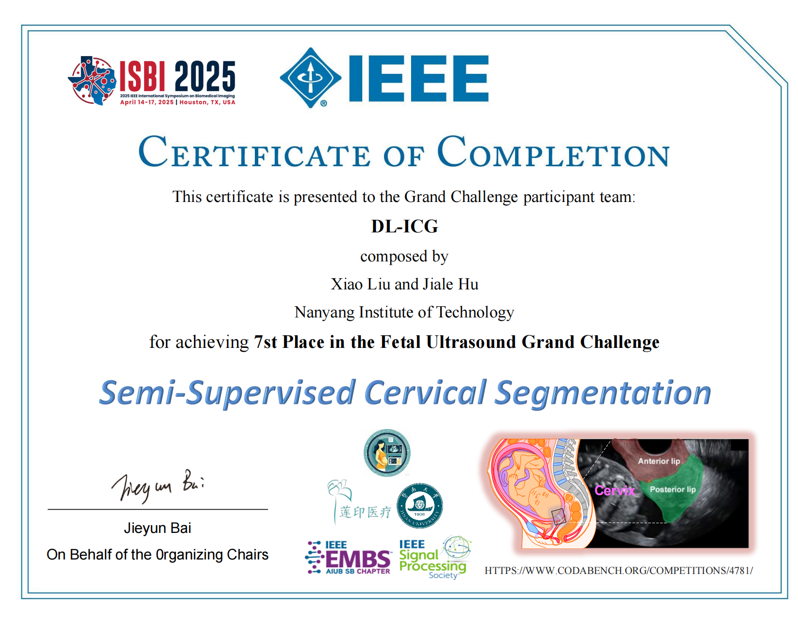

# 胎儿超声大挑战：半监督宫颈分割

## DL-ICG 团队第 7 名解决方案 [比赛链接](https://www.codabench.org/competitions/4781/) [Github 链接](https://github.com/maskoffs/Fetal-Ultrasound-Grand-Challenge)

<p align="center">
  
</p>


### 方案概述
我们的方法分为两个阶段。具体而言，在第一阶段，我们首先采用 UniMatch 半监督学习方法，使用 10 张有标注图像作为验证集，并将 40 张有标注图像与 450 张无标注图像结合起来进行模型训练。随后，我们使用训练好的模型对无标注图像进行推理，生成伪标签，并人工筛选出一部分高质量的伪标签加入训练集。在第二阶段，我们采用全监督的方式对模型进行进一步训练。该过程会不断重复，直到积累足够数量的高质量伪标签。

### 模型结果
模型采用 UNet 架构。我们最终的预测模型采用 PVT_v2_b1 与 ResNet34d 之间的平均集成（averaging ensemble）方法。测试得分如下：

| 模型名称  |  Dice  | hd95  | 时间  |
|------|------|------|------|
| PVT_v2_b1 + ResNet34d | 0.8518 | 58.8085  | 349.5664 |

### 环境配置
使用单张显存为 24GB 的 NVIDIA 4090 显卡进行训练，建议使用 Python 3.10 版本的环境。使用 `pip install -r requirements.txt` 安装第三方库。
要创建虚拟环境并安装第三方库，请进入 `apufugc2025` 目录并执行以下命令：
```bash
conda create -n uni python=3.10
conda activate uni
pip3 install torch torchvision torchaudio --index-url https://download.pytorch.org/whl/cu118
pip install -r requirements.txt
```

### 项目目录
```
project-root/
├── configs/        存放模型训练配置文件
├── dataset/        数据集目录
├── figs/           图片目录
├── inputs/         存放训练数据集
├── medical_util/   医学相关工具函数
├── model/          模型定义代码
├── model_pth/      预训练模型权重
├── trained_model_path/  我们训练得到的最佳模型权重
├── util/           工具函数
├── LICENSE         许可证文件
├── model.py        竞赛平台的推理代码
├── requirements.txt  需要安装的第三方库列表
├── semi_supervised_unimatch.py  半监督训练代码
└── supervised_train.py  全监督训练代码
```

### 模型训练
1. **semi_supervised_unimatch.py** 是半监督训练脚本，**supervised_train.py** 是全监督训练脚本。
2. **全监督训练**：
```bash
python supervised_train.py --config ./configs/pvt_fugc.yaml --data_path ./inputs/train_50_pse_374_26 --train_data_txt ./inputs/train_50_pse_374_26/train_images410.txt \
 --test_data_txt ./inputs/train_50_pse_374_26/val_images40.txt --save_path your_training_save_path
```

3. **半监督训练**：
```bash
python semi_supervised_unimatch.py --config ./configs/pvt_fugc.yaml --save_path your_training_save_path --train_unlabeled_path ./inputs/train/unlabeled_data \
   --train_labeled_path ./inputs/train/labeled_data --train_unlabeled_txt_path ./inputs/train/train_unlabeled.txt --train_labeled_txt_path ./inputs/train/train_labeled.txt --test_labeled_path \
   ./inputs/train/labeled_data --test_labeled_txt_path ./inputs/train/test_labeled.txt
```

### 复现我们的结果
注意：由于我们在训练过程中忘记固定随机种子，复现结果时可能会存在一些偏差，但应该不会太大。

#### （全监督训练）
##### 步骤 1：确保使用我们提供的全监督训练数据集（50 张有标注图像以及我们人工筛选出的 400 张高质量伪标签），它们存放在 `./inputs/train_50_pse_374_26` 目录中。
##### 步骤 2：执行训练代码
###### 训练 PVT_v2_b1_UNet 模型

确保 `pvt_fugc.yaml` 文件已进行如下配置：
- `epochs` 设置为 `150`
- `model_name` 设置为 `pvt_v2_b1`
- `pred_model_path` 设置为 `./model_path/pvt_v2_b1_feature_only.pth`

使用以下命令启动训练过程：

```bash
python supervised_train.py \
  --config ./configs/pvt_fugc.yaml \
  --data_path ./inputs/train_50_pse_374_26 \
  --train_data_txt ./inputs/train_50_pse_374_26/train_images410.txt \
  --test_data_txt ./inputs/train_50_pse_374_26/val_images40.txt \
  --save_path your_training_save_path
```
###### 训练 ResNet34d_UNet 模型

确保 `resnet_fugc.yaml` 文件已进行如下配置：
- `epochs` 设置为 `150`
- `model_name` 设置为 `resnet34d`
- `pred_model_path` 设置为 `./model_path/resnet34d_feature_only.pth`

使用以下命令启动训练过程：
```bash
python supervised_train.py \
  --config ./configs/resnet_fugc.yaml \
  --data_path ./inputs/train_50_pse_374_26 \
  --train_data_txt ./inputs/train_50_pse_374_26/train_images410.txt \
  --test_data_txt ./inputs/train_50_pse_374_26/val_images40.txt \
  --save_path your_training_save_path
```

##### 步骤 3：运行竞赛平台预测代码
将全监督训练得到的权重放入 `./trained_model_path` 目录，并修改 `model.py` 文件中的权重加载路径。或者，你也可以直接使用 `./trained_model_path` 目录中提供的模型权重进行最终测试，它们是 `pvt_b1_latest.pth` 和 `resnet34d_latest.pth`。
```bash
python model.py
```

#### （半监督训练）
尽管我们的最终方案是使用伪标签进行全监督训练，但我们也在此提供半监督训练流程。注意：由于我们在训练过程中忘记固定随机种子，半监督训练获得最佳模型所需的最优 epoch 数可能会有所不同。在我们的训练中，PVT_v2_b1_UNet 的最佳 epoch 为 20，ResNet34_UNet 为 60。因此，我们建议直接使用我们已经训练好的权重，其存储路径为 `./trained_model_pth/pvt_b1_ori_imgsize_epoch_20.pth` 和 `./trained_model_pth/resnet34_ori_imgsize_epoch_60.pth`。然而，这些仅是半监督训练过程中得到的权重，还需要对 PVT_v2_b1_UNet 和 ResNet34_UNet 的权重进行平均融合，然后推理生成伪标签。此外，还需要确保伪标签的筛选方式与我们一致。因此，我们建议使用我们已筛选好的伪标签进行全监督训练。

##### 训练 PVT_v2_b1_UNet 模型

###### 步骤 1：准备配置文件
确保 `pvt_fugc.yaml` 文件已进行如下配置：
- `model_name` 设置为 `pvt_v2_b1`
- `pred_model_path` 设置为 `./model_path/pvt_v2_b1_feature_only.pth`

###### 步骤 2：运行训练脚本
使用以下命令启动训练过程：
```bash
python semi_supervised_unimatch.py \
  --config ./configs/pvt_fugc.yaml \
  --save_path your_training_save_path \
  --train_unlabeled_path ./inputs/train/unlabeled_data \
  --train_labeled_path ./inputs/train/labeled_data \
  --train_unlabeled_txt_path ./inputs/train/train_unlabeled.txt \
  --train_labeled_txt_path ./inputs/train/train_labeled.txt \
  --test_labeled_path ./inputs/train/labeled_data \
  --test_labeled_txt_path ./inputs/train/test_labeled.txt
```


##### 训练 ResNet34_UNet 模型

###### 步骤 1：准备配置文件
确保 `resnet_fugc.yaml` 文件已进行如下配置：
- `model_name` 设置为 `resnet34`
- `pred_model_path` 设置为 `./model_path/resnet34_feature_only.pth`

###### 步骤 2：运行训练脚本
使用以下命令启动训练过程：
```bash
python semi_supervised_unimatch.py \
  --config ./configs/resnet_fugc.yaml \
  --save_path your_training_save_path \
  --train_unlabeled_path ./inputs/train/unlabeled_data \
  --train_labeled_path ./inputs/train/labeled_data \
  --train_unlabeled_txt_path ./inputs/train/train_unlabeled.txt \
  --train_labeled_txt_path ./inputs/train/train_labeled.txt \
  --test_labeled_path ./inputs/train/labeled_data \
  --test_labeled_txt_path ./inputs/train/test_labeled.txt
```
